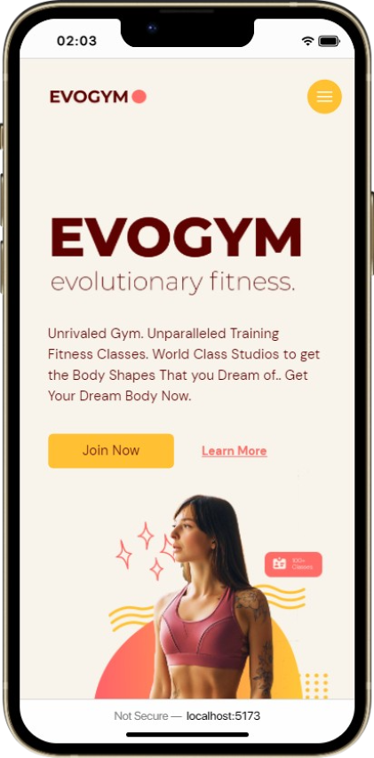
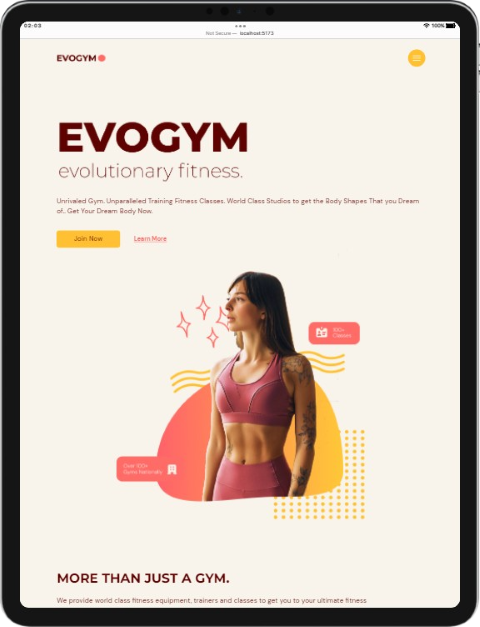
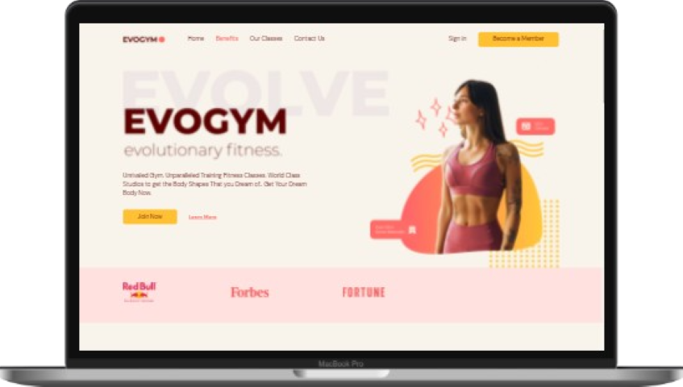

<h1 align="center">Evolutionary Fitness 💪</h1>

|  |  |  |
| -------------------------------------- | ---------------------------------------- | ------------------------------------------ |

## What's this? 🤔

A prototype landing page for a prototype bussiness called EvoGym. It's fully responsive, dynamic and very lightweight 🍃.

### Tools used 🧰

- [NodeJS](https://nodejs.org/)
- [Vite](https://vitejs.dev/)
- [React](https://reactjs.org/)
- [TypeScript](https://typescriptlang.org/)
- [Framer Motion](https://www.framer.com/motion/)
- [TailwindCSS](https://tailwindcss.com/)
- [HeroIcons](https://heroicons.dev/)
- [PostCSS](https://postcss.org/)
- [Autoprefixer](https://autoprefixer.github.io/)
- [Firefox](https://www.mozilla.org/en-US/firefox/)
- [Visual Studio Code](https://code.visualstudio.com/)
